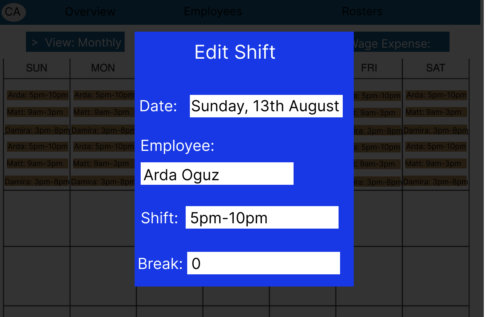
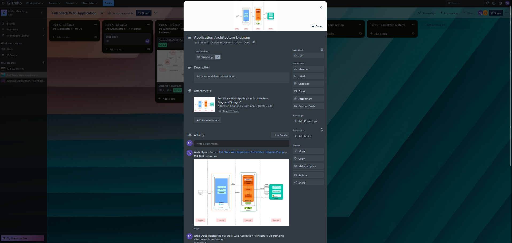

Deployed Website:
Github Repository: https://github.com/ArdaEO14455/Full-Stack-Web-Application

-----------------------------------------------------------------
### Purpose

In most industries employees have a consistent schedule that is not subject to sporadic changes or fluctuations . However, that is not the case when it comes to “continuous operation industries”: businesses and organisations that need to stay open 24 hours to provide their services, such as Hospitality, Healthcare, Transportation industries and many more public services.  Since they operate long hours and have to always have someone on site to provide the necessary services, their shifts  can be set anywhere from a week to months in advance . Due to the  nature of shift-work, many variables such as employee’s personal requests, budget limitations, emergencies need to be factored into shift delegation and management. This prompts a pressing need for an application designed to optimise the workflow and facilitate better resource and labour management.

Our proposed application would become an irreplaceable scheduling tool that offers projected expense insights, employee profile detailing & storage, and streamlined shift scheduling & management. This approach empowers users to efficiently manage workforce allocation, and optimise & predict operational costs.

----------------------------------------------------------------
### Functionality/Features

Overview Page: 

Offers a read-only format that is designed to present users with a concise and comprehensive overview of the week’s schedule at a single glance.

Key features:

Displays the information about the schedule for the current week in a form of a calendar
Provides data about the shifts (employee names along with their shift hours)
Demonstrates the projected wage expense for the chosen timeframe as well as total hours allocated

Employee Management: 

Provides users with general insights into the current workforce, offering general information about each employed individual. 

Key features:

Provides users with an opportunity to add individual employee profiles.
Enables users with the flexibility to append, remove, or modify any relevant details, promoting effortless control over employee information management
Users can retrieve specific employee details and be given an overview of their upcoming shifts, and edit them freely:

Rosters Page:
- Monthly View:

- Weekly View:

A calendar display showcasing the schedule for a selected time frame, featuring designated employees for each shift alongside their corresponding hours of assignment. Mirroring the functionality of the Overview page, it also presents the allocated hours and wage expenses. 

Key features:

Ability to designate any desired time frame and access the corresponding information
Flexibility to add, delete and edit shifts as needed:

----------------------------------------------------------------

### Target Audience

**Hospitality Managers** 

A scheduling application would prove itself to be useful for managers and supervisors overseeing the allocation of shifts for their team members in various departments such as Front Office, Food & Beverage, Housekeeping and so on. 

**Healthcare administrators**

Admin employees overseeing medical facilities can ensure 24/7 coverage by efficiently scheduling doctors, nurses and any other support staff. 

**Emergency services** 

Police, fire, and medical services would benefit from the application by efficiently rostering staff to respond to emergencies at any time. 

**School/University Administrators** 

The scheduling app would help administrators in the education sector create optimised class schedules and assign teachers based on their availability/preferences. 

**Business Owners** 

Entrepreneurs and business proprietors who manage their staff’s work hours and align them with budget allocations would benefit from using this application.This application would enforce efficient management of their workforce and facilitate budget planning by presenting them with expected labor expenses associated with different scheduling scenarios.  

----------------------------------------------------------------

### Tech Stack

The scheduling application will be developed using Javascript and the MERN stack: MongoDB, Express.js, React and Node.js. 

**Javascript**

Javascript is the programming language that is used to build interactive and dynamic user interfaces.

**Node.js**

Node.js is an environment that lets developers run Javascript code on the server side. Node.js will become a foundation for our server by providing the environment for Express.js to handle API requests, communicating with the database (MongoDB) and managing server-side functionalities. 

**Express.js**

Express.js is a web application framework for Node.js. It simplifies the process of developing resilient APIs and handling server-side logic. When it comes to the scheduling app, Express.js will help manage routes, handle user requests from the front-end, interact with the MongoDB database and process business logic like shift scheduling and expense projection. 

**MongoDB**

MongoDB is a NoSQL database that will be suitable to use for our app because it is ideal for data that changes over time. Since the application will handle a wide range of different data such as employee profiles and shift details, it makes MongoDB an ideal fit due to its flexible and dynamic schema.

**React** 

React is a Javascript library for building user interfaces. It allows users to create dynamic UI components. In our application, React will enable us to build an interactive user interface, displaying calendars, shifts and employee profiles. React’s virtual DOM efficiently updates only the necessary parts of the UI, making the user experience smooth and responsive.

----------------------------------------------------------------

## Dataflow Diagram

The notation used to represent the dataflow diagram for the application is Yourdon and Coad. 

----------------------------------------------------------------

## Application Architecture Diagram

----------------------------------------------------------------

## User Stories

- “**As the venue manager for a local pub**, I don't have much time to be managing and keeping track of the shifts for my staff. On busy days I can't spend half my day in the office checking who is already working on what day, making sure everyone has the right amount of hours, getting calls from people saying I didn't give them enough hours or I put them on a day that they can't work. I have a pub to run.”  
- “**I am a shift manager for the NSW Ambulance**, and there isn't a single minute where we can't be running fully staffed, so I need to make sure that we always have teams on hand at any given moment, and know who I can call in if our hands are full.”  
- “**I work as a receptionist at a local vet clinic**, but we are a small clinic, so I also organise the shifts. I have to allocate shifts based on how many appointments we have and what patients we currently have that need daily treatments, but our budget is tight and I need to stay within the lines.  
- “**I run a high end cocktail bar in the city**. We have high staff turnover and everyone who comes in wants to work different days, different hours, and we have a mix of full-time staff and casual staff: bar staff, floor staff, security, and managers. I need to know when I need to hire more staff based on who is on the team at a given time and how much I'm spending on wages, and be able to keep track of who can work when to make sure I have a solid team every night.”  
- “**I work the reception at my local general practice**, and am in charge of booking patient appointments for the GPs, but each of them work different days. I’d like to be able to see at a glance who is working what days so that I can book people in accordingly, as it’ll save me the hassle of calling GPs on their days off to confirm their shift, then call patients back to confirm their appointment”.

## Wireframes

### Overview Page 

Desktop Screen Size:

Tablet Screen Size:

Mobile Screen Size:

### Rosters Page

**Roster Monthly View**

Desktop Screen Size:

Tablet Screen Size:

Mobile Screen Size:

**Roster Weekly View**

Desktop Screen Size:

Tablet Screen Size:

Mobile Screen Size:

**Edit Shift**

Desktop Screen Size:

Tablet Screen Size:

Mobile Screen Size:

**New Shift**

Desktop Screen Size:

Tablet Screen Size:

Mobile Screen Size:

### Employees Page

Desktop Screen Size:

Tablet Screen Size:

Mobile Screen Size:

### New Employee Page

Desktop Screen Size:

Tablet Screen Size:

Mobile Screen Size:

### Employee Details Page

Desktop Screen Size:

Tablet Screen Size:

Mobile Screen Size:

## Trello board screenshots

Trello Board: https://trello.com/b/FduD2Wej/full-stack-web-application

Our team followed Agile methodology when working on the Part A of the project. Requirements were divided between the team members and reviewed after the completion of each one. Trello board was divided into four parts to demonstrate that accordingly: "To Do", "In Progress", "To be Reviewed", and "Done".  

Part A planning process:

Part B planning process:

Part B Development

